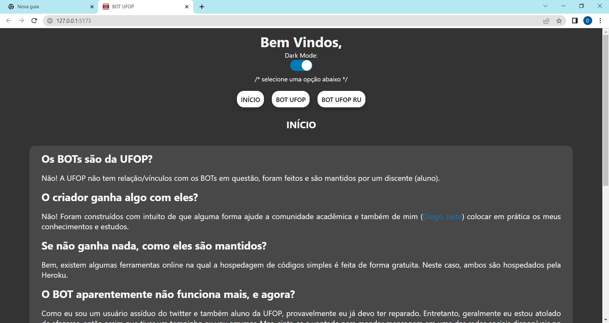
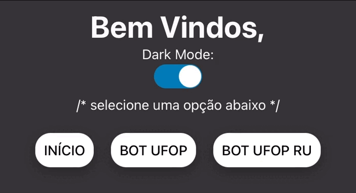

# Landing Page BOT UFOP

> Construído em React e TypeScript

<h3>Uma página web simples contento informações sobre o <a href="https://github.com/diogoleite87/BOT-TWITTER-UFOP">BOT UFOP</a> e o <a href="https://github.com/diogoleite87/BOT-TWITTER-UFOP-RU">BOT UFOP RU</a>.</h3>

 

    <h3>Tela Inicial no Desktop!</h3>
    

 

    <h3>Site Responsivo!</h3>
    

 

    <h3>Destaque para o modo noturno!</h3>
    

